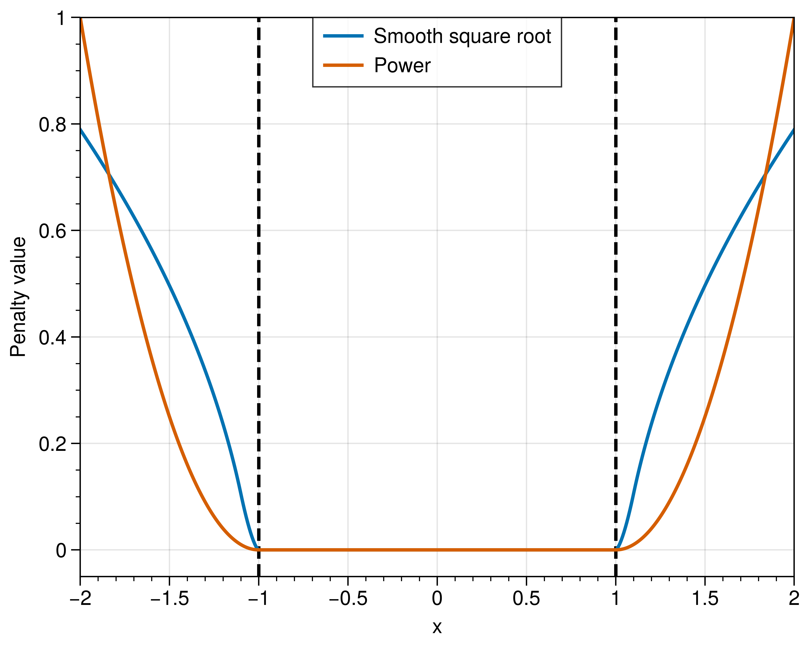

# pypenalty

Smooth penalty functions for optimization.

## Example

`example.py`:

</img>

## References

1. Y. Duan and S. Lian, “Smoothing Approximation to the Square-Root Exact Penalty Function,” Journal of Systems Science and Information, vol. 4, no. 1, pp. 87–96, Feb. 2016, doi: 10.1515/JSSI-2016-0087.
